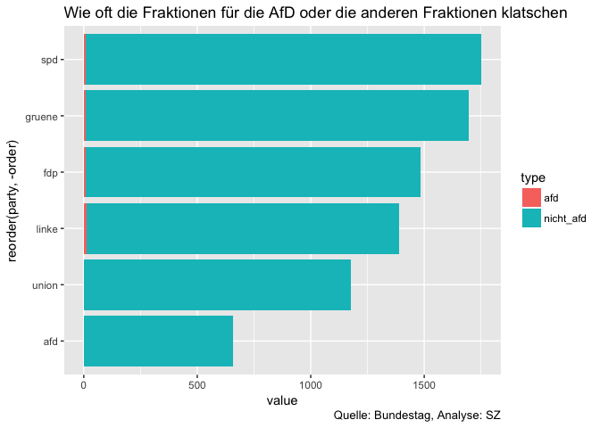
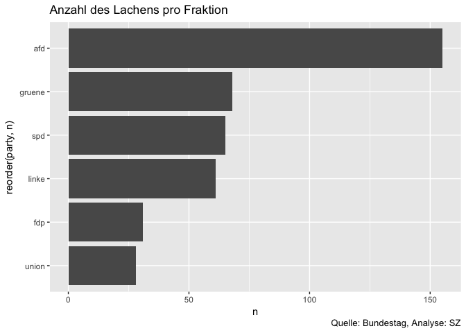
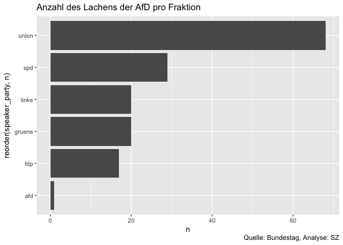

Daten aus Bundestagsprotokollen
================

Am 24. April sind sechs Monate seit der konstituierenden Sitzung des 19. Bundestags vergangen. Wie hat sich das Parlament mit dem Einzug der Rechten verändert? Wie prägen die Rechten das Miteinander, das Klima, die Abläufe im Bundestag? Das wieder eine zumindest in Teilen rechtsextreme Partei im Parlament sitzt, ist eine Zäsur in der Geschichte der Bundesrepublik. Angesichts des Verhaltens von AfD-Politikern vor dem Einzug in den Bundestag, ihren Verbindungen zu rechtsextremen Kreisen, ihren teils rechtsradikalen und fremdenfeindlichen Äußerungen erschien es uns wichtig, nachvollziehbar und transparent zu machen, wie Vertreter dieser Partei im Bundestag agieren, wie sie parlamentarische Prozesse beeinflussen. In die Öffentlichkeit gelangen sonst in der Regel nur die besonderen Vorkommnisse, wichtige Entscheidungen, herausragende Reden, extreme Provokationen. Mit der [Datenauswertung aller Protokolle](http://sz.de/afdimbundestag) - nicht nur bestimmter Ereignisse - über einen längeren Zeitraum objektivieren die Wahrnehmung und Bewertung des Geschehens dort.

In diesem Repo veröffentlichen wir die aus den Protokollen [extrahierten Daten](data/bundestagsprotkolle_19.csv).

Veröffentlichte Artikel
-----------------------

-   Digitale Reportage: [Das gespaltene Parlament](http://sz.de/afdimbundestag)
-   Weitere Datenauswertung: [Neuer Bundestag, alte Fronten](http://sz.de/1.3950836)
-   Methodik: [So analysieren wir den Bundestag](http://sz.de/1.3944784)
-   Interview mit einem Stenografen des Bundestags: ["Es ist in alle Richtungen leidenschaftlicher geworden. Keine Frage"](http://sz.de1.3951366)

Datengrundlage
--------------

Wenn die Abgeordneten im Bundestag diskutieren, wird jedes gesprochene Wort akribisch dokumentiert. Stenografen sitzen in jeder Plenardebatte und schreiben mit, was um sie herum passiert: Wer was sagt, wer klatscht, wer dazwischenruft, wer lacht, wer einer Aussage widerspricht und wie. Diese Aufzeichnungen landen in seitenlangen Dokumenten ([hier zum Beispiel das Protokoll der ersten Sitzung nach der Bundestagswahl im Oktober](http://dip21.bundestag.de/dip21/btp/19/19001.pdf), die kurz nach der Debatte im Internet veröffentlicht werden. Für die Süddeutsche Zeitung waren sie der Ausgangspunkt der Recherche, um das Auftreten der AfD im Bundestag und den Umgang mit ihr zu analysieren. Mehr zur [Methodik auf SZ.de](http://sz.de/1.3944784).

-   [Protokolle des Bundestags als PDF](https://www.bundestag.de/dokumente/protokolle/plenarprotokolle)
-   [Protokolle des Bundestags als XML](https://www.bundestag.de/service/opendata)

Beschreibung der Daten
----------------------

-   Stand: 24. Sitzungstag
-   In diesem Repository gibt es eine [`.csv`-Datei](data/bundestagsprotokolle_19.csv), in der ein Teil unserer extrahierten Daten aus den Bundestagsprotokollen zu finden sind.

<table>
<colgroup>
<col width="9%" />
<col width="90%" />
</colgroup>
<thead>
<tr class="header">
<th>Variable</th>
<th>Beschreibung</th>
</tr>
</thead>
<tbody>
<tr class="odd">
<td>sitzung_id</td>
<td>Sitzungsnmmer</td>
</tr>
<tr class="even">
<td>text</td>
<td>Originaltext aus dem Protokoll</td>
</tr>
<tr class="odd">
<td>type</td>
<td>Art der Aktion:Beifall, Heiterkeit, Lachen, Widerspruch, Zuruf</td>
</tr>
<tr class="even">
<td>party</td>
<td>agierende Fraktion</td>
</tr>
<tr class="odd">
<td>zurufer_name</td>
<td>Person, die zuruft</td>
</tr>
<tr class="even">
<td>zuruf_text</td>
<td>Zuruf im Wortlaut</td>
</tr>
<tr class="odd">
<td>speaker_party</td>
<td>Fraktion der sprechenden Person (Anmerkung: Die Person muss nicht notwendigerweise die Person am Rednerpult sein, z.B. wenn jemand eine Zwischenfrage stellt)</td>
</tr>
<tr class="even">
<td>speech_id</td>
<td>ID der Rede (aus <code>XML</code>-Datei)</td>
</tr>
<tr class="odd">
<td>top</td>
<td>Tagesordnungspunkt</td>
</tr>
<tr class="even">
<td>beschreibung</td>
<td>Beschreibung des Tagesordnungspunkts</td>
</tr>
<tr class="odd">
<td>party_action</td>
<td>agierte die ganze Fraktion (<code>1</code>) oder Teile der Fraktion (<code>0</code>)</td>
</tr>
</tbody>
</table>

Zentrale Auswertungen
---------------------

Wir fokussieren uns auch die Reaktionen zwischen den Fraktionen. Applaus für moderierende Ämter, wie zum Beispiel für den Bundestagspräsidenten spielen keine Rolle. Rollenbezeichnungen wie `Bundeskanzlerin` haben wir in Fraktionsbezeichnungen umgewandelt.

``` r
library(dplyr)
library(ggplot2)
library(tidyr)

# import data
df <- read.csv("data/bundestagsprotokolle_19.csv", sep = "\t", stringsAsFactors = F)
party_vector <- c("afd", "fdp", "gruene", "linke", "spd", "union")
```

So oft tauchen die Parteien in den Daten pro Kategorie auf:

``` r
df %>% 
  filter(party %in% party_vector, speaker_party %in% party_vector) %>% 
  count(party, type) %>% 
  spread(type, n) %>%
  mutate(sum = rowSums(.[2:6])) %>% 
  arrange(desc(sum))
```

    ## # A tibble: 6 x 7
    ##   party  beifall heiterkeit lachen widerspruch zuruf   sum
    ##   <chr>    <int>      <int>  <int>       <int> <int> <dbl>
    ## 1 gruene    3019         68     68          46  1302 4503.
    ## 2 spd       3511         80     65          38   773 4467.
    ## 3 union     3303         85     28          15   870 4301.
    ## 4 linke     2753         34     61          47  1010 3905.
    ## 5 afd       2196         46    155          61  1173 3631.
    ## 6 fdp       2629         66     31          12   625 3363.

Beifall
-------

Wieviel klatschen die Fraktionen für sich selbst und wieviel für die anderen?

``` r
df_beifall_self <- df %>%  
  filter(type == "beifall", party == speaker_party, party %in% party_vector, speaker_party %in% party_vector) %>% 
  count(party) %>% 
  rename(self = n)

df_beifall_others <- df %>% 
  filter(type == "beifall", party != speaker_party, party %in% party_vector, speaker_party %in% party_vector) %>% 
  count(party)  %>% 
  rename(others = n)

df_beifall_all <- df %>%
  filter(type == "beifall", party %in% party_vector, speaker_party %in% party_vector) %>% 
  count(party) %>% 
  rename(all = n)

df_beifall_all %>% 
  left_join(df_beifall_self, by = "party") %>% 
  left_join(df_beifall_others, by = "party") %>% 
  mutate(share_self = self/all,
         share_others = others/all) %>% 
  arrange(desc(share_self)) %>% 
  mutate(order = row_number()) %>% 
  tidyr::gather(type, factor, 5:6) %>% 
  ggplot(aes(x = reorder(party, -order), y = factor, group = type, fill = type)) +
    geom_bar(stat = "identity") +
    scale_y_continuous(labels = scales::percent) +
    coord_flip() +
    labs(title = "Anteil des Beifalls für die eigene Fraktion und andere Fraktionen")
```


Wenn eine Partei für andere klatscht, wie oft klatscht dann die ganze Fraktion und wann nur Teile einer Fraktion?

``` r
df %>% 
  filter(type == "beifall", party != speaker_party, party %in% party_vector, speaker_party %in% party_vector) %>% 
  count(party, party_action) %>% 
  spread(party_action, n) %>% 
  mutate(sum =  `0` +`1`) %>% 
  arrange(desc(sum)) %>% 
  mutate(order = row_number()) %>% 
  rename(ganze_partei = `0`, teile_der_partei = `1`) %>% 
  gather(party_action, value, -party, -sum, -order) %>% 
  ggplot(aes(x = reorder(party, -order), y = value, group = party_action, fill = party_action)) +
  geom_bar(stat = "identity") +
  coord_flip()
```


Wie viel klatschen die Fraktionen für andere? Und wieviel Aufmerksamkeit bekommt die AfD von den anderen Parteien?

``` r
df %>%  
  filter(type == "beifall", party %in% party_vector, speaker_party %in% party_vector, party != speaker_party) %>% 
  count(party, speaker_party) %>% 
  filter(party %in% party_vector, speaker_party %in% party_vector) %>% 
  spread(speaker_party, n) %>% 
  rowwise() %>% 
  mutate(nicht_afd = sum(fdp, gruene, linke, spd, union, na.rm= TRUE)) %>% 
  arrange(desc(nicht_afd)) %>% 
  mutate(order = row_number()) %>% 
  select(party, afd, nicht_afd, order) %>% 
  gather(type, value, -order, -party) %>% 
  ggplot(aes(x = reorder(party, -order), y = value, fill = type, group = desc(type))) +
  geom_bar(stat = "identity") +
  coord_flip() +
  labs(title= "Wie oft die Fraktionen für die AfD oder die anderen Fraktionen klatschen",
       caption = "Quelle: Bundestag, Analyse: SZ")
```



Wer klatscht für wen?

``` r
df %>% 
  filter(party %in% party_vector, speaker_party %in% party_vector, party != speaker_party, type == "beifall") %>% 
  count(party, speaker_party) %>% 
  arrange(desc(n))
```

    ## # A tibble: 30 x 3
    ##    party  speaker_party     n
    ##    <chr>  <chr>         <int>
    ##  1 spd    union           871
    ##  2 fdp    union           828
    ##  3 union  spd             606
    ##  4 linke  gruene          587
    ##  5 gruene spd             573
    ##  6 gruene union           467
    ##  7 linke  spd             461
    ##  8 spd    gruene          440
    ##  9 gruene linke           424
    ## 10 fdp    spd             328
    ## # ... with 20 more rows

Zurufe
------

Welche Fraktion ruft am meisten zu?

``` r
df %>% 
  filter(party %in% party_vector, speaker_party %in% party_vector, party != speaker_party, type == "zuruf") %>% 
  count(party) %>% 
  arrange(desc(n))
```

    ## # A tibble: 6 x 2
    ##   party      n
    ##   <chr>  <int>
    ## 1 gruene  1268
    ## 2 afd     1138
    ## 3 linke    957
    ## 4 union    762
    ## 5 spd      722
    ## 6 fdp      582

Welche Fraktion ruft wie oft einer anderen zu?

``` r
df %>% 
  filter(party %in% party_vector, speaker_party %in% party_vector, party != speaker_party, type == "zuruf") %>% 
  count(party, speaker_party) %>% 
  arrange(desc(n))
```

    ## # A tibble: 30 x 3
    ##    party  speaker_party     n
    ##    <chr>  <chr>         <int>
    ##  1 gruene union           506
    ##  2 afd    union           464
    ##  3 gruene afd             453
    ##  4 linke  union           449
    ##  5 spd    afd             334
    ##  6 union  afd             269
    ##  7 afd    spd             254
    ##  8 linke  afd             223
    ##  9 afd    gruene          194
    ## 10 gruene spd             182
    ## # ... with 20 more rows

Lachen
------

Welche Fraktion lacht wie oft?

``` r
df %>% 
  filter(type == "lachen", party %in% party_vector, speaker_party %in% party_vector) %>% 
  count(party) %>% 
  ggplot(aes(x = reorder(party, n), y = n)) +
  geom_bar(stat = "identity") +
  coord_flip() +
  labs(title = "Anzahl des Lachens pro Fraktion",
       caption = "Quelle: Bundestag, Analyse: SZ")
```



Wer lacht über wen?

``` r
df %>% 
  filter(type == "lachen", party %in% party_vector, speaker_party %in% party_vector) %>% 
  count(party, speaker_party) %>% 
  arrange(desc(n))
```

    ## # A tibble: 29 x 3
    ##    party  speaker_party     n
    ##    <chr>  <chr>         <int>
    ##  1 afd    union            68
    ##  2 spd    afd              58
    ##  3 gruene afd              48
    ##  4 linke  afd              34
    ##  5 afd    spd              29
    ##  6 union  afd              23
    ##  7 linke  union            21
    ##  8 afd    gruene           20
    ##  9 afd    linke            20
    ## 10 afd    fdp              17
    ## # ... with 19 more rows

Über wen lacht die AfD? Die AfD lacht vor allem Sprecher der Union aus.

``` r
df %>% 
  filter(type == "lachen", party == "afd", party %in% party_vector, speaker_party %in% party_vector) %>% 
  group_by(party, speaker_party) %>% 
  summarise(n = n()) %>% 
  mutate(share = n/sum(n)) %>% 
  ggplot(aes(x = reorder(speaker_party, n), y = n)) +
  geom_bar(stat = "identity") +
  coord_flip() +
  labs(title = "Anzahl des Lachens der AfD pro Fraktion",
       caption = "Quelle: Bundestag, Analyse: SZ")
```



Kontakt
-------

[Katharina Brunner](katharina.brunner@sz.de) oder [Martina Schories](martina.schories@sz.de)
