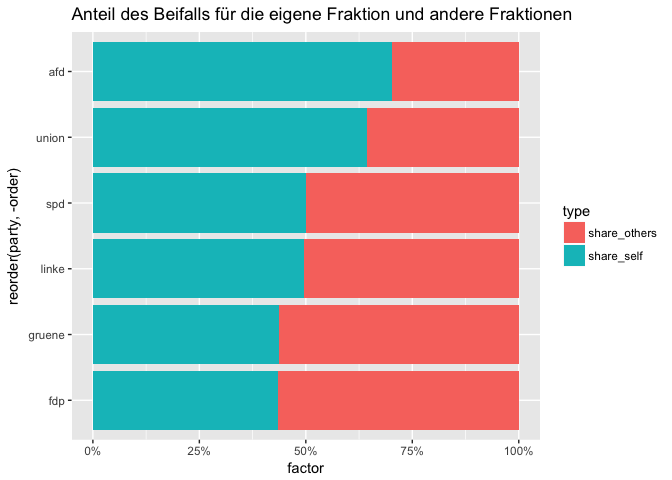

Daten zu den Bundestagsprotokollen
================
Katharina Brunner und Martina Schories
1.  April 2018

-   [Variables](#variables)
-   [Lachen](#lachen)
    -   [Welche Fraktion lacht wie oft?](#welche-fraktion-lacht-wie-oft)
    -   [Über wen lacht die AfD?](#über-wen-lacht-die-afd)
    -   [Wen lachen die anderen Parteien aus?](#wen-lachen-die-anderen-parteien-aus)

Variables
---------

<table style="width:100%;">
<colgroup>
<col width="8%" />
<col width="81%" />
<col width="7%" />
<col width="3%" />
</colgroup>
<thead>
<tr class="header">
<th>Column</th>
<th>Description</th>
<th>Type</th>
<th></th>
</tr>
</thead>
<tbody>
<tr class="odd">
<td>sitzung_id</td>
<td>The number of the debate</td>
<td>int</td>
<td></td>
</tr>
<tr class="even">
<td>text</td>
<td>original text from protocol</td>
<td>chr</td>
<td></td>
</tr>
<tr class="odd">
<td>type</td>
<td>type of action: Beifall, Heiterkeit, Lachen, Widerspruch, Zuruf</td>
<td>chr</td>
<td></td>
</tr>
<tr class="even">
<td>party</td>
<td>assigned party to action like clapping or interrupting</td>
<td>chr</td>
<td></td>
</tr>
<tr class="odd">
<td>zurufer_name</td>
<td>name of the person who interrupts</td>
<td>chr</td>
<td></td>
</tr>
<tr class="even">
<td>zuruf_text</td>
<td>text of the interruption</td>
<td>chr</td>
<td></td>
</tr>
<tr class="odd">
<td>speaker_party</td>
<td>party of the speaker</td>
<td>chr</td>
<td></td>
</tr>
<tr class="even">
<td>speaker_name</td>
<td>the name of the person currently speaking (notion: the speaker is not neccessarily the person at the lectern, e.g. when there is an interposed question)</td>
<td>chr</td>
<td></td>
</tr>
<tr class="odd">
<td>speech_id</td>
<td>id of the speech from XML file</td>
<td>chr</td>
<td></td>
</tr>
<tr class="even">
<td>top</td>
<td>agenda item</td>
<td>chr</td>
<td></td>
</tr>
<tr class="odd">
<td>beschreibung</td>
<td>description of agenda item</td>
<td>chr</td>
<td></td>
</tr>
<tr class="even">
<td>zwischenfrage</td>
<td>is the speaker asking a question? If yes <code>1</code>, if no <code>0</code></td>
<td>int</td>
<td></td>
</tr>
<tr class="odd">
<td>party_action</td>
<td>is the whole party clapping, laughing... (<code>1</code>) or just parts (<code>0</code>)?</td>
<td>int</td>
<td></td>
</tr>
</tbody>
</table>

``` r
library(dplyr)
```

    ## 
    ## Attaching package: 'dplyr'

    ## The following objects are masked from 'package:stats':
    ## 
    ##     filter, lag

    ## The following objects are masked from 'package:base':
    ## 
    ##     intersect, setdiff, setequal, union

``` r
library(ggplot2)

# import data
df <- read.csv("data/bundestagsprotokolle_19.csv", sep = "\t", stringsAsFactors = F)
```

Lachen
------

### Welche Fraktion lacht wie oft?

``` r
df %>% 
  filter(type == "lachen") %>% 
  count(party) %>% 
  ggplot(aes(x = reorder(party, n), y = n)) +
  geom_bar(stat = "identity") +
  coord_flip() +
  labs(title = "Anzahl des Lachens pro Fraktion",
       caption = "Quelle: Bundestag, Analyse: SZ")
```


### Über wen lacht die AfD?

Die AfD lacht vor allem Sprecher der Union aus.

``` r
df %>% 
  filter(type == "lachen", party == "afd") %>% 
  group_by(party, speaker_party) %>% 
  summarise(n = n()) %>% 
  mutate(share = n/sum(n)) %>% 
  ggplot(aes(x = reorder(speaker_party, n), y = n)) +
  geom_bar(stat = "identity") +
  coord_flip() +
  labs(title = "Anzahl des Lachens der AfD pro Fraktion",
       caption = "Quelle: Bundestag, Analyse: SZ")
```



### Wen lachen die anderen Parteien aus?

Die anderen Parteien (insbesondere die SPD) lachen auch vor allem die AfD aus.

``` r
df %>% 
  filter(type == "lachen", party != "afd") %>% 
  group_by(party, speaker_party) %>% 
  summarise(n = n()) %>% 
  mutate(share = n/sum(n)) %>% 
  arrange(desc(n))
```

    ## # A tibble: 29 x 4
    ## # Groups:   party [5]
    ##    party  speaker_party      n  share
    ##    <chr>  <chr>          <int>  <dbl>
    ##  1 spd    afd               58 0.892 
    ##  2 gruene afd               48 0.696 
    ##  3 linke  afd               34 0.548 
    ##  4 union  afd               23 0.821 
    ##  5 fdp    afd               16 0.516 
    ##  6 linke  union             16 0.258 
    ##  7 gruene bundesminister     9 0.130 
    ##  8 fdp    spd                7 0.226 
    ##  9 gruene spd                4 0.0580
    ## 10 linke  bundesminister     4 0.0645
    ## # ... with 19 more rows
