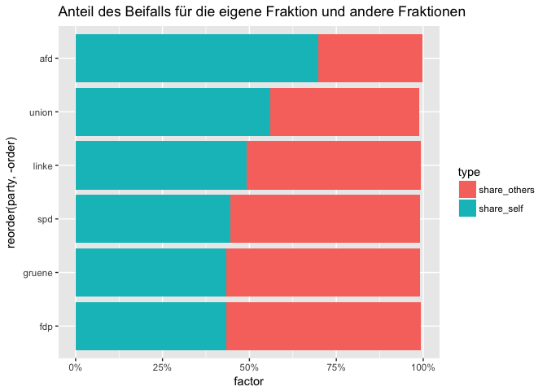
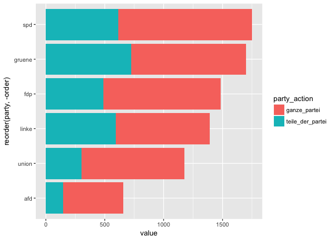
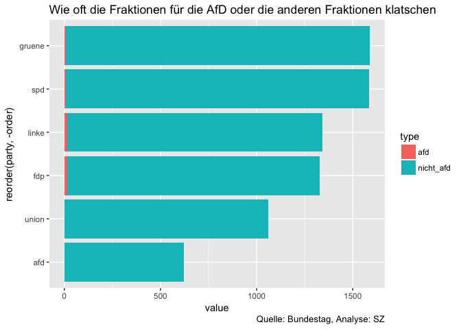

Daten zu den Bundestagsprotokollen
================
Katharina Brunner und Martina Schories
1.  April 2018

-   [Beschreibung der Daten](#beschreibung-der-daten)
-   [Beifall](#beifall)
    -   [Wieviel klatschen die Fraktionen für sich selbst und wieviel für die anderen?](#wieviel-klatschen-die-fraktionen-für-sich-selbst-und-wieviel-für-die-anderen)
    -   [Wenn eine Partei für andere klatscht, wie oft klatscht dann die ganze Fraktion und wann nur Teile einer Fraktion?](#wenn-eine-partei-für-andere-klatscht-wie-oft-klatscht-dann-die-ganze-fraktion-und-wann-nur-teile-einer-fraktion)
    -   [Wie viel klatschen die Fraktionen für andere?](#wie-viel-klatschen-die-fraktionen-für-andere)
-   [Lachen](#lachen)
    -   [Welche Fraktion lacht wie oft?](#welche-fraktion-lacht-wie-oft)
    -   [Über wen lacht die AfD?](#über-wen-lacht-die-afd)
    -   [Bei welchen Rednern lachen die Fraktionen (ohne AfD)?](#bei-welchen-rednern-lachen-die-fraktionen-ohne-afd)
-   [Absolute Zahlen](#absolute-zahlen)

Stand: 24. Sitzungstag

Beschreibung der Daten
----------------------

<table style="width:100%;">
<colgroup>
<col width="8%" />
<col width="81%" />
<col width="7%" />
<col width="3%" />
</colgroup>
<thead>
<tr class="header">
<th>Column</th>
<th>Description</th>
<th>Type</th>
<th></th>
</tr>
</thead>
<tbody>
<tr class="odd">
<td>sitzung_id</td>
<td>The number of the debate</td>
<td>int</td>
<td></td>
</tr>
<tr class="even">
<td>text</td>
<td>original text from protocol</td>
<td>chr</td>
<td></td>
</tr>
<tr class="odd">
<td>type</td>
<td>type of action: Beifall, Heiterkeit, Lachen, Widerspruch, Zuruf</td>
<td>chr</td>
<td></td>
</tr>
<tr class="even">
<td>party</td>
<td>assigned party to action like clapping or interrupting</td>
<td>chr</td>
<td></td>
</tr>
<tr class="odd">
<td>zurufer_name</td>
<td>name of the person who interrupts</td>
<td>chr</td>
<td></td>
</tr>
<tr class="even">
<td>zuruf_text</td>
<td>text of the interruption</td>
<td>chr</td>
<td></td>
</tr>
<tr class="odd">
<td>speaker_party</td>
<td>party of the speaker</td>
<td>chr</td>
<td></td>
</tr>
<tr class="even">
<td>speaker_name</td>
<td>the name of the person currently speaking (notion: the speaker is not neccessarily the person at the lectern, e.g. when there is an interposed question)</td>
<td>chr</td>
<td></td>
</tr>
<tr class="odd">
<td>speech_id</td>
<td>id of the speech from XML file</td>
<td>chr</td>
<td></td>
</tr>
<tr class="even">
<td>top</td>
<td>agenda item</td>
<td>chr</td>
<td></td>
</tr>
<tr class="odd">
<td>beschreibung</td>
<td>description of agenda item</td>
<td>chr</td>
<td></td>
</tr>
<tr class="even">
<td>zwischenfrage</td>
<td>is the speaker asking a question? If yes <code>1</code>, if no <code>0</code></td>
<td>int</td>
<td></td>
</tr>
<tr class="odd">
<td>party_action</td>
<td>is the whole party clapping, laughing... (<code>1</code>) or just parts (<code>0</code>)?</td>
<td>int</td>
<td></td>
</tr>
</tbody>
</table>

``` r
library(dplyr)
```

    ## 
    ## Attaching package: 'dplyr'

    ## The following objects are masked from 'package:stats':
    ## 
    ##     filter, lag

    ## The following objects are masked from 'package:base':
    ## 
    ##     intersect, setdiff, setequal, union

``` r
library(ggplot2)
library(tidyr)

# import data
df <- read.csv("data/bundestagsprotokolle_19.csv", sep = "\t", stringsAsFactors = F)
party_vector <- c("afd", "fdp", "gruene", "linke", "spd", "union")
```

Beifall
-------

### Wieviel klatschen die Fraktionen für sich selbst und wieviel für die anderen?

``` r
df_beifall_self <- df %>%  
  filter(type == "beifall", party == speaker_party) %>% 
  count(party) %>% 
  rename(self = n)

df_beifall_others <- df %>% 
  filter(type == "beifall", party != speaker_party) %>% 
  count(party)  %>% 
  rename(others = n)

df_beifall_all <- df %>%
  filter(type == "beifall") %>% 
  count(party) %>% 
  rename(all = n)

df_beifall_all %>% 
  left_join(df_beifall_self, by = "party") %>% 
  left_join(df_beifall_others, by = "party") %>% 
  mutate(share_self = self/all,
         share_others = others/all) %>% 
  filter(party %in% party_vector) %>% 
  arrange(desc(share_self)) %>% 
  mutate(order = row_number()) %>% 
  tidyr::gather(type, factor, 5:6) %>% 
  ggplot(aes(x = reorder(party, -order), y = factor, group = type, fill = type)) +
    geom_bar(stat = "identity") +
    scale_y_continuous(labels = scales::percent) +
    coord_flip() +
    labs(title = "Anteil des Beifalls für die eigene Fraktion und andere Fraktionen")
```



Durchschnitt und Standardabweichung: Nur die AfD liegt außerhalb der Standardabweichung.

``` r
df_beifall_all %>% 
  left_join(df_beifall_self, by = "party") %>% 
  left_join(df_beifall_others, by = "party") %>% 
  mutate(share_self = self/all,
         share_others = others/all) %>% 
  filter(party %in% party_vector) %>% 
  arrange(desc(share_self)) %>% 
  mutate(order = row_number()) %>% 
  tidyr::gather(type, factor, 5:6) %>% 
  group_by(type) %>% 
  summarise(mean = mean(factor), sd = sd(factor))
```

    ## # A tibble: 2 x 3
    ##   type          mean    sd
    ##   <chr>        <dbl> <dbl>
    ## 1 share_others 0.483 0.102
    ## 2 share_self   0.510 0.104

### Wenn eine Partei für andere klatscht, wie oft klatscht dann die ganze Fraktion und wann nur Teile einer Fraktion?

Die AfD klatscht deutlich weniger für andere. Und wenn sie es doch tut, dann sind das vor allem einzelne Abgeordnete oder nur Teile der Fraktion.

``` r
df %>% 
  filter(type == "beifall", party != speaker_party) %>% 
  count(party, party_action) %>% 
  spread(party_action, n) %>% 
  mutate(sum =  `0` +`1`) %>% 
  arrange(desc(sum)) %>% 
  mutate(order = row_number()) %>% 
  rename(ganze_partei = `0`, teile_der_partei = `1`) %>% 
  gather(party_action, value, -party, -sum, -order) %>% 
  ggplot(aes(x = reorder(party, -order), y = value, group = party_action, fill = party_action)) +
  geom_bar(stat = "identity") +
  coord_flip()
```

    ## Warning: Removed 1 rows containing missing values (position_stack).



Relativ:

``` r
df %>% 
  filter(type == "beifall", party != speaker_party) %>% 
  count(party, party_action) %>% 
  spread(party_action, n) %>% 
  mutate(sum =  `0` +`1`) %>% 
  filter(party %in% party_vector) %>% 
  mutate(others_all = round(`1`/sum, 2),
         others_part = round(`0`/sum, 2)) 
```

    ## # A tibble: 6 x 6
    ##   party    `0`   `1`   sum others_all others_part
    ##   <chr>  <int> <int> <int>      <dbl>       <dbl>
    ## 1 afd      515   148   663      0.220       0.780
    ## 2 fdp      994   492  1486      0.330       0.670
    ## 3 gruene   974   726  1700      0.430       0.570
    ## 4 linke    797   595  1392      0.430       0.570
    ## 5 spd     1161   776  1937      0.400       0.600
    ## 6 union    909   525  1434      0.370       0.630

### Wie viel klatschen die Fraktionen für andere?

Und wieviel Aufmerksamkeit bekommt die AfD von den anderen Parteien?

``` r
df %>%  
  filter(type == "beifall", party != "alle", party != speaker_party) %>% 
  count(party, speaker_party) %>% 
  filter(party %in% party_vector, speaker_party %in% party_vector) %>% 
  spread(speaker_party, n) %>% 
  rowwise() %>% 
  mutate(nicht_afd = sum(fdp, gruene, linke, spd, union, na.rm= TRUE)) %>% 
  arrange(desc(nicht_afd)) %>% 
  mutate(order = row_number()) %>% 
  select(party, afd, nicht_afd, order) %>% 
  gather(type, value, -order, -party) %>% 
  ggplot(aes(x = reorder(party, -order), y = value, fill = type, group = desc(type))) +
  geom_bar(stat = "identity") +
  coord_flip() +
  labs(title= "Wie oft die Fraktionen für die AfD oder die anderen Fraktionen klatschen",
       caption = "Quelle: Bundestag, Analyse: SZ")
```

    ## Warning: Removed 1 rows containing missing values (position_stack).



Lachen
------

### Welche Fraktion lacht wie oft?

``` r
df %>% 
  filter(type == "lachen") %>% 
  count(party) %>% 
  ggplot(aes(x = reorder(party, n), y = n)) +
  geom_bar(stat = "identity") +
  coord_flip() +
  labs(title = "Anzahl des Lachens pro Fraktion",
       caption = "Quelle: Bundestag, Analyse: SZ")
```


### Über wen lacht die AfD?

Die AfD lacht vor allem Sprecher der Union aus.

``` r
df %>% 
  filter(type == "lachen", party == "afd") %>% 
  group_by(party, speaker_party) %>% 
  summarise(n = n()) %>% 
  mutate(share = n/sum(n)) %>% 
  ggplot(aes(x = reorder(speaker_party, n), y = n)) +
  geom_bar(stat = "identity") +
  coord_flip() +
  labs(title = "Anzahl des Lachens der AfD pro Fraktion",
       caption = "Quelle: Bundestag, Analyse: SZ")
```


### Bei welchen Rednern lachen die Fraktionen (ohne AfD)?

Die anderen Parteien (insbesondere die SPD) lachen auch vor allem die AfD aus.

``` r
df %>% 
  filter(type == "lachen", party != "afd") %>% 
  group_by(party, speaker_party) %>% 
  summarise(n = n()) %>% 
  mutate(share = n/sum(n)) %>% 
  arrange(desc(n))
```

    ## # A tibble: 29 x 4
    ## # Groups:   party [5]
    ##    party  speaker_party      n  share
    ##    <chr>  <chr>          <int>  <dbl>
    ##  1 spd    afd               58 0.892 
    ##  2 gruene afd               48 0.696 
    ##  3 linke  afd               34 0.548 
    ##  4 union  afd               23 0.821 
    ##  5 fdp    afd               16 0.516 
    ##  6 linke  union             16 0.258 
    ##  7 gruene bundesminister     9 0.130 
    ##  8 fdp    spd                7 0.226 
    ##  9 gruene spd                4 0.0580
    ## 10 linke  bundesminister     4 0.0645
    ## # ... with 19 more rows

Absolute Zahlen
---------------

So oft tauchen die Parteien in den Daten pro Kategorie auf:

``` r
df %>% 
  filter(party %in% party_vector, speaker_party %in% party_vector) %>% 
  count(party, type) %>% 
  spread(type, n) %>%
  mutate(sum = rowSums(.[2:6])) %>% 
  arrange(desc(sum))
```

    ## # A tibble: 6 x 7
    ##   party  beifall heiterkeit lachen widerspruch zuruf   sum
    ##   <chr>    <int>      <int>  <int>       <int> <int> <dbl>
    ## 1 gruene    2908         64     59          44  1215 4290.
    ## 2 spd       3160         77     65          38   761 4101.
    ## 3 union     2931         78     28          15   862 3914.
    ## 4 linke     2704         34     55          45   949 3787.
    ## 5 afd       2163         45    146          61  1138 3553.
    ## 6 fdp       2472         64     29          12   601 3178.
